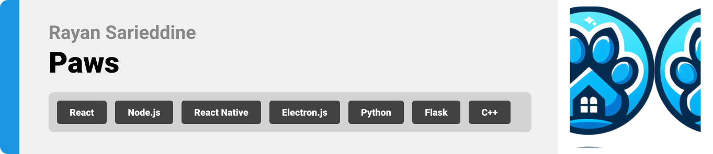

<br><br>

<!-- project philosophy -->


> HOME OF PETS!  
> Paws, an ensemble of innovative platforms, revolutionizes pet care by integrating a Live Tracker device, infusing AI-driven dialogue and real-time chat, crafting machine learning searches for lost companions, nurturing pet adoption, and curating a dedicated shop for pet essentials and beyond.

### User Stories

-As a person looking to adopt a pet I want a platform where I can browse all the pets available for adoption so that I can choose my preference.  
-As a pet owner I want a platform where I can shop for my pet’s food and toys and get them delivered to me so that I can save time.  
-As a shoper I want to be able to chat with someone to help me with my inquires so that I can choose the products I need for my pet.  
-As a pet owner I want to be able to chat with someone who will be able to answer questions about my pet 24/7 so that I can keep my pet healthy and happy.  
-As a pet owner I want a tracker device to put on my dog’s collar so that I can track him on a portal if it gets lost.  
-As a pet owner who lost a pet I want a portal where I can search for my pet by uploading its image so that I can find it.
-As a person who found a lost pet I want a portal where I can report it so that It can be found

### Admin Stories

-As an admin I want to be able to manage inventory so that I can keep track of the products.  
-As an admin I want to be able to add pets and list them for adoption so that users can see them.  
-As an admin I want to approve or reject adoption requests so that I can make sure the pets are going to a safe place.  
-As an admin I want to be able to chat with the users of the website in real-time.  
<br><br>

<!-- Prototyping -->
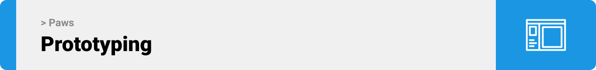

> The design process for Paws began with meticulous planning, utilizing Excalidraw for initial structuring of the project. This foundational step ensured a cohesive and well-organized structure. Subsequently, the project transitioned to Figma, where detailed wireframes and sophisticated mockups were meticulously crafted, laying the groundwork for a visually compelling and user-friendly design.  
> Below is a collection of some of the wireframes and mockups.

### Wireframes

> Website
> | Adopt Main Page | Adopt All Pets Page| Adopt Pet Page |
> | --------------------------------------- | ------------------------------------- | ------------------------------------- |
> | 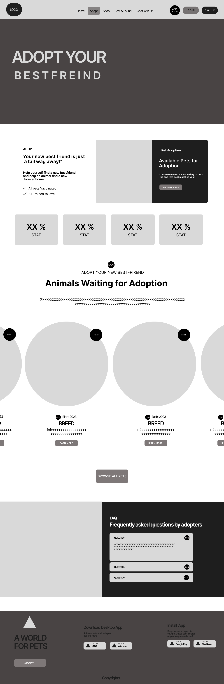 | 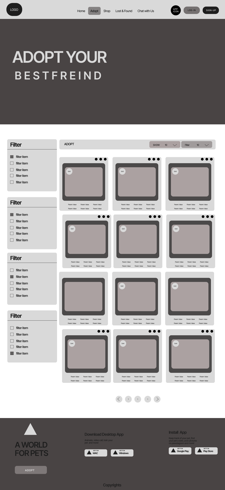 | 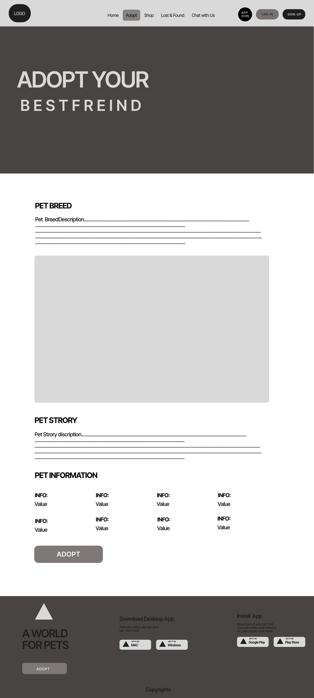 |

> Mobile Application
> | OnBoarding Screen | Tracker Screen | Chat Screen |
> | --------------------------------------- | ------------------------------------- | ------------------------------------- |
> | 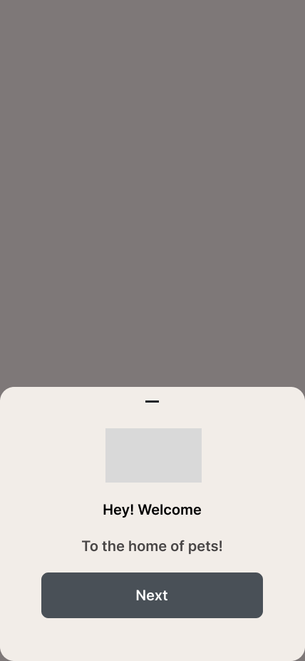 | 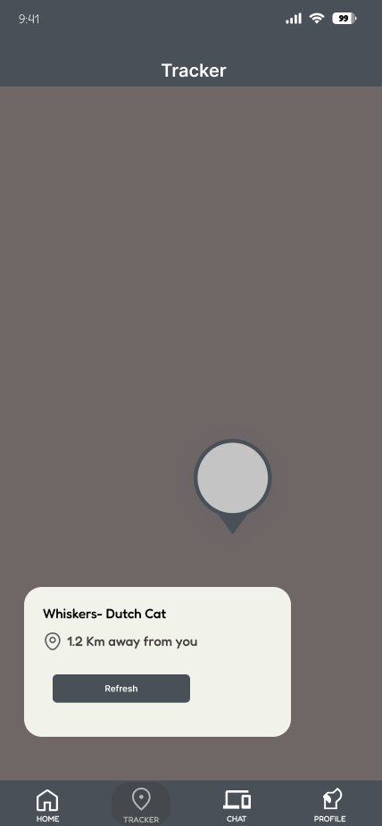 | 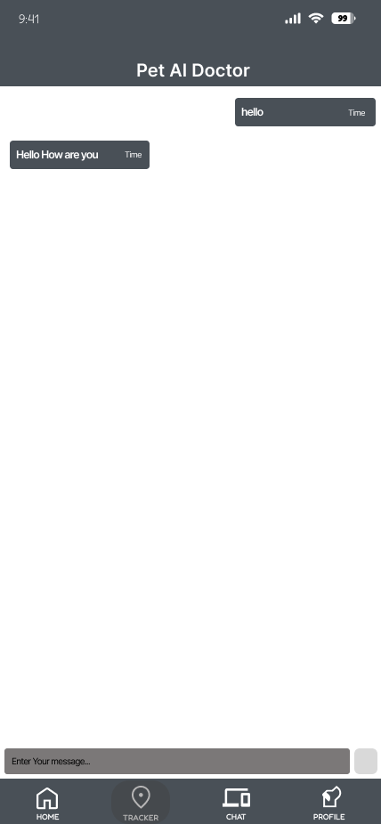 |

> Desktop Application
> | Dashboard Page| Order Details Page | Add Pet Page |
> | --------------------------------------- | ------------------------------------- | ------------------------------------- |
> | 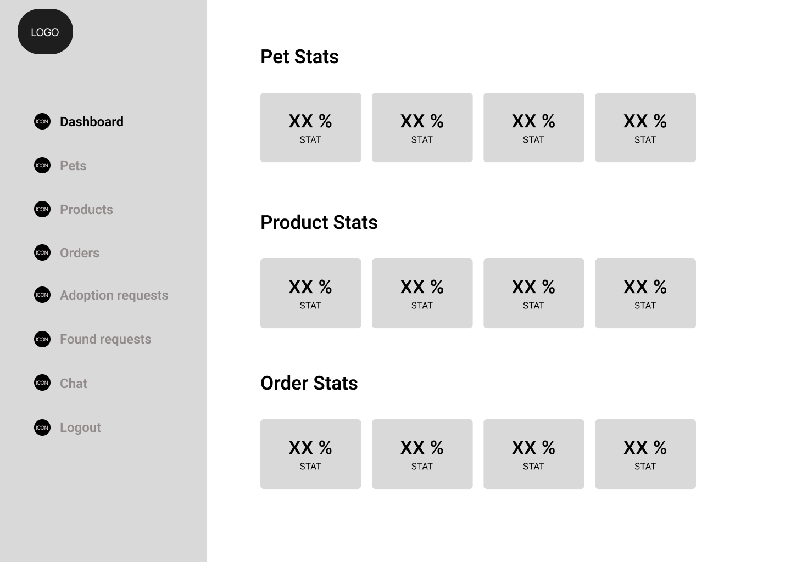 | 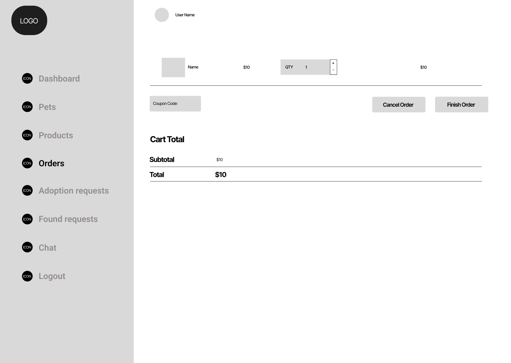 | 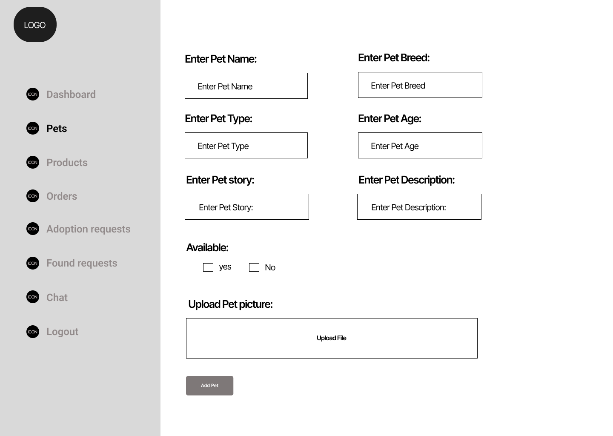 |

### Mockups

> Website
> | Home Page | Lost reporting Page| Shop Item Page |
> | --------------------------------------- | ------------------------------------- | ------------------------------------- |
> | 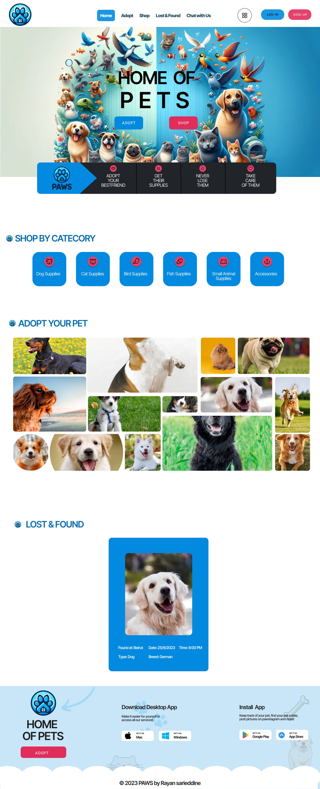 | 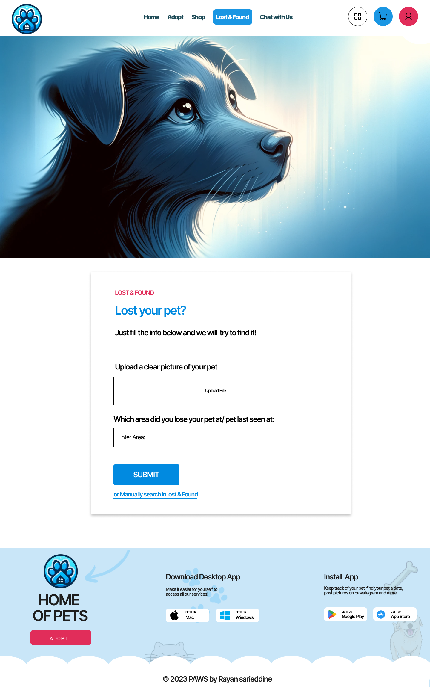 | 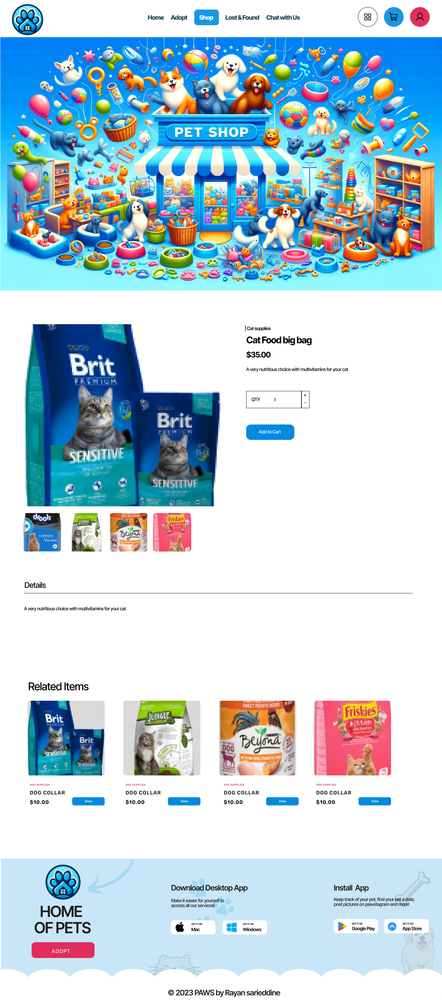 |

> Mobile Application
> | OnBoarding Screen | Tracker Screen | Chat Screen |
> | --------------------------------------- | ------------------------------------- | ------------------------------------- |
> |  | 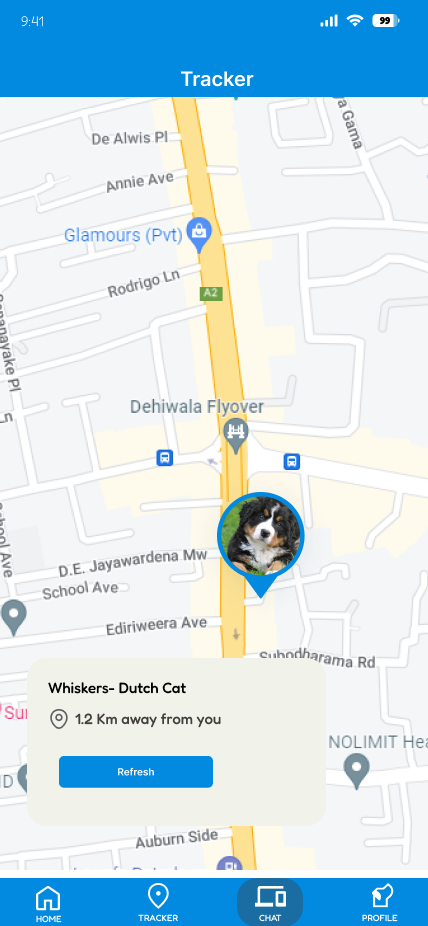 | 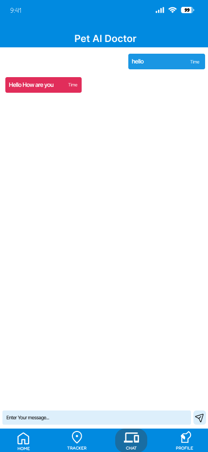 |

> Desktop Application
> | Products Page| Adoption Requests Page | Login Page |
> | --------------------------------------- | ------------------------------------- | ------------------------------------- |
> | 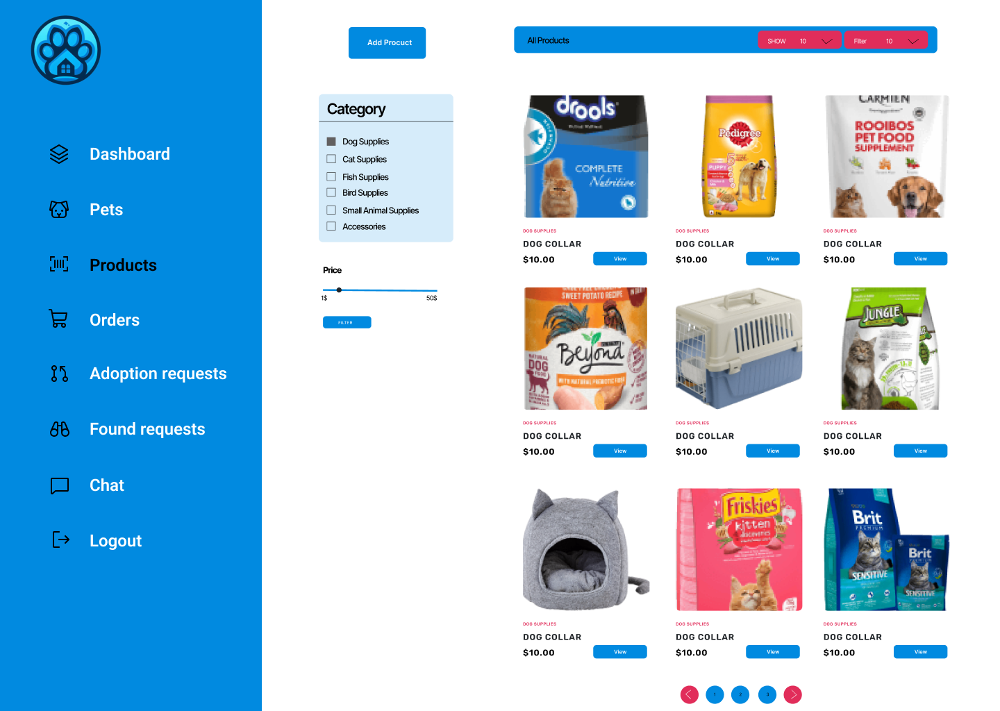 | 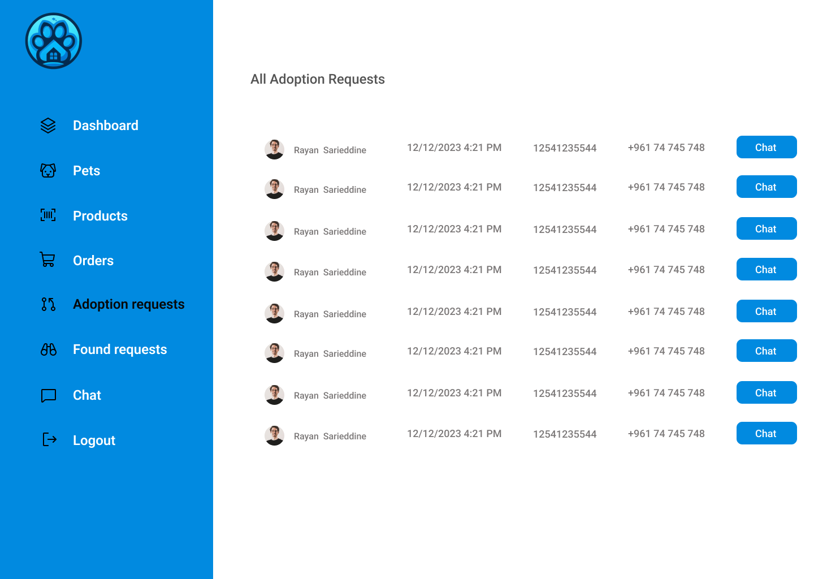 | 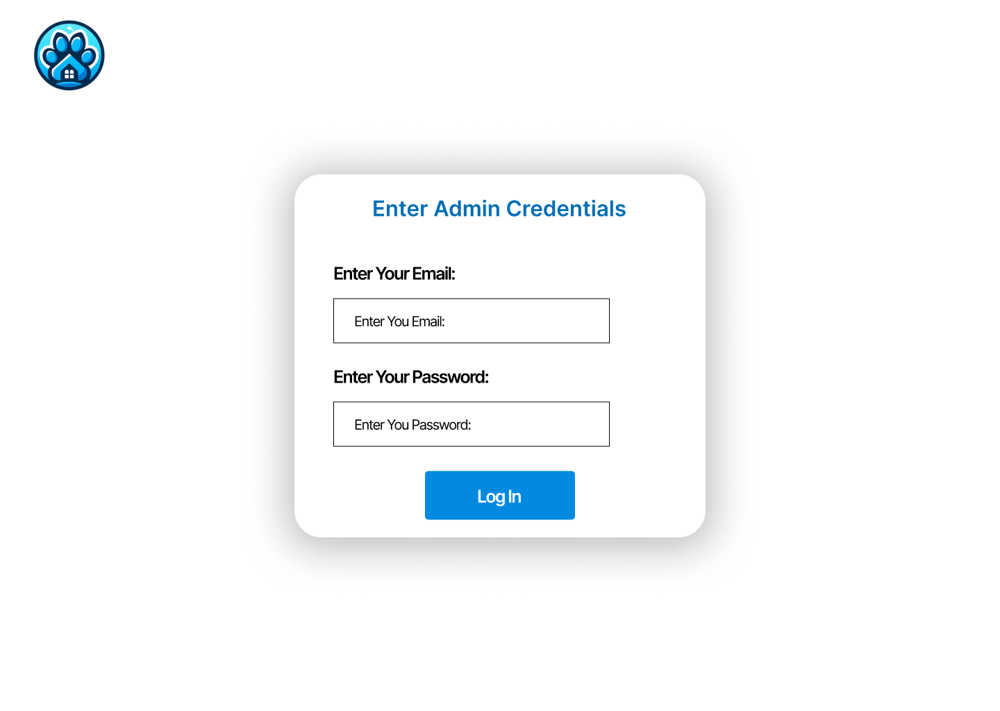 |

<br><br>

<!-- Implementation -->
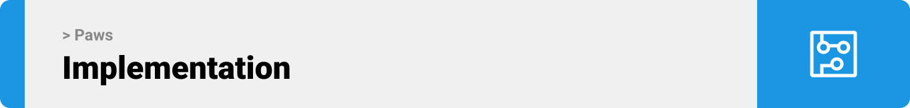

> Using the wireframes and mockups as a guide, we implemented the Coffee Express app with the following features:

### User Screens (Mobile)

| Login screen                              | Register screen                         | Landing screen                          | Loading screen                          |
| ----------------------------------------- | --------------------------------------- | --------------------------------------- | --------------------------------------- |
|  |  |  |  |
| Home screen                               | Menu Screen                             | Order Screen                            | Checkout Screen                         |
|  |  |  |  |

### Admin Screens (Web)

| Login screen                            | Register screen                       | Landing screen                        |
| --------------------------------------- | ------------------------------------- | ------------------------------------- |
|  |  |  |
| Home screen                             | Menu Screen                           | Order Screen                          |
|  |  |  |

<br><br>

<!-- Tech stack -->


### Coffee Express is built using the following technologies:

- This project uses the [Flutter app development framework](https://flutter.dev/). Flutter is a cross-platform hybrid app development platform which allows us to use a single codebase for apps on mobile, desktop, and the web.
- For persistent storage (database), the app uses the [Hive](https://hivedb.dev/) package which allows the app to create a custom storage schema and save it to a local database.
- To send local push notifications, the app uses the [flutter_local_notifications](https://pub.dev/packages/flutter_local_notifications) package which supports Android, iOS, and macOS.
  - 🚨 Currently, notifications aren't working on macOS. This is a known issue that we are working to resolve!
- The app uses the font ["Work Sans"](https://fonts.google.com/specimen/Work+Sans) as its main font, and the design of the app adheres to the material design guidelines.

<br><br>

<!-- How to run -->


> To set up Coffee Express locally, follow these steps:

### Prerequisites

This is an example of how to list things you need to use the software and how to install them.

- npm
  ```sh
  npm install npm@latest -g
  ```

### Installation

_Below is an example of how you can instruct your audience on installing and setting up your app. This template doesn't rely on any external dependencies or services._

1. Get a free API Key at [https://example.com](https://example.com)
2. Clone the repo
   ```sh
   git clone https://github.com/your_username_/Project-Name.git
   ```
3. Install NPM packages
   ```sh
   npm install
   ```
4. Enter your API in `config.js`
   ```js
   const API_KEY = "ENTER YOUR API";
   ```

Now, you should be able to run Coffee Express locally and explore its features.
