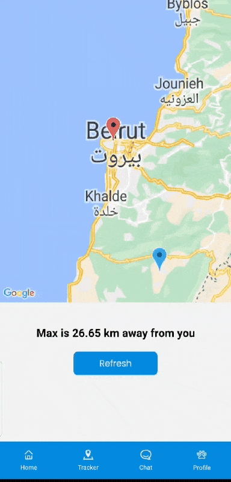

<br><br>

<!-- project philosophy -->


> HOME OF PETS!  
> Paws, an ensemble of innovative platforms, revolutionizes pet care by integrating a Live Tracker device, infusing AI-driven dialogue and real-time chat, crafting machine learning searches for lost companions, nurturing pet adoption, and curating a dedicated shop for pet essentials and beyond.

### User Stories

-As a person looking to adopt a pet I want a platform where I can browse all the pets available for adoption so that I can choose my preference.  
-As a pet owner I want a platform where I can shop for my pet’s food and toys and get them delivered to me so that I can save time.  
-As a shoper I want to be able to chat with someone to help me with my inquires so that I can choose the products I need for my pet.  
-As a pet owner I want to be able to chat with someone who will be able to answer questions about my pet 24/7 so that I can keep my pet healthy and happy.  
-As a pet owner I want a tracker device to put on my dog’s collar so that I can track him on a portal if it gets lost.  
-As a pet owner who lost a pet I want a portal where I can search for my pet by uploading its image so that I can find it.
-As a person who found a lost pet I want a portal where I can report it so that It can be found

### Admin Stories

-As an admin I want to be able to manage inventory so that I can keep track of the products.  
-As an admin I want to be able to add pets and list them for adoption so that users can see them.  
-As an admin I want to approve or reject adoption requests so that I can make sure the pets are going to a safe place.  
-As an admin I want to be able to chat with the users of the website in real-time.  
<br><br>

<!-- Prototyping -->


> The design process for Paws began with meticulous planning, utilizing Excalidraw for initial structuring of the project. This foundational step ensured a cohesive and well-organized structure. Subsequently, the project transitioned to Figma, where detailed wireframes and sophisticated mockups were meticulously crafted, laying the groundwork for a visually compelling and user-friendly design.  
> Below is a collection of some of the wireframes and mockups.

### Wireframes

> Website
> | Adopt Main Page | Adopt All Pets Page| Adopt Pet Page |
> | --------------------------------------- | ------------------------------------- | ------------------------------------- |
> |  |  |  |

> Mobile Application
> | OnBoarding Screen | Tracker Screen | Chat Screen |
> | --------------------------------------- | ------------------------------------- | ------------------------------------- |
> |  |  |  |

> Desktop Application
> | Dashboard Page| Order Details Page | Add Pet Page |
> | --------------------------------------- | ------------------------------------- | ------------------------------------- |
> |  |  |  |

### Mockups

> Website
> | Home Page | Lost reporting Page| Shop Item Page |
> | --------------------------------------- | ------------------------------------- | ------------------------------------- |
> |  |  |  |

> Mobile Application
> | OnBoarding Screen | Tracker Screen | Chat Screen |
> | --------------------------------------- | ------------------------------------- | ------------------------------------- |
> |  |  |  |

> Desktop Application
> | Products Page| Adoption Requests Page | Login Page |
> | --------------------------------------- | ------------------------------------- | ------------------------------------- |
> |  |  |  |

<br><br>

<!-- Implementation -->


> Guided by the meticulously designed wireframes and mockups, we developed the Paws website and desktop application, equipping them with an array of features. These enhancements were strategically integrated to ensure a seamless and enriched user experience, on the web, mobile and on the desktop platforms:

### User Pages (Web)

> | Register Page                                            | Login Page                                         |
> | -------------------------------------------------------- | -------------------------------------------------- |
> |  |  |

> | Google Login                                                | Terms & Conditions Page                                         |
> | ----------------------------------------------------------- | --------------------------------------------------------------- |
> |  |  |

> | Home Page                                        | Adopt Main                                                   |
> | ------------------------------------------------ | ------------------------------------------------------------ |
> |  |  |

> | Adopt Pets Page                                         | Adopt Process                                                    |
> | ------------------------------------------------------- | ---------------------------------------------------------------- |
> |  |  |

> | Shop Page                                   | Shop Process                                                |
> | ------------------------------------------- | ----------------------------------------------------------- |
> |  |  |

> | Found Reporting                                         | Lost Reporting 1                                              |
> | ------------------------------------------------------- | ------------------------------------------------------------- |
> |  |  |

> | Lost Reporting 2                                               | Lost Reporting 3                                                  |
> | -------------------------------------------------------------- | ----------------------------------------------------------------- |
> |  |  |

> | Chat Page                                        | Edit Profile Page                                                |
> | ------------------------------------------------ | ---------------------------------------------------------------- |
> |  |  |

> | Error Page  
> | ------------------------------------------------
> | 

### User Screens (App)

> | Onboarding Screen                                           | Login Screen                                         |
> | ----------------------------------------------------------- | ---------------------------------------------------- |
> |  |  |

> | Register Screen                                            | Add Pet Screen                                           |
> | ---------------------------------------------------------- | -------------------------------------------------------- |
> |  |  |

> | Home Screen                                        | Tracker Screen                                       |
> | -------------------------------------------------- | ---------------------------------------------------- |
> |  |  |

> | Chat Screen                                        | Profile Screen                                           |
> | -------------------------------------------------- | -------------------------------------------------------- |
> |  |  |

### Admin Pages (Desktop)

| Login Page  
| -----------------------------------------
| 

| Dashboard Page  
| -----------------------------------------
| 

| All Pets Page  
| -----------------------------------------
| 

| Edit Pet Page
| -----------------------------------------
| 

| Add Pet Page  
| -----------------------------------------
| 

| All Products Page  
| -----------------------------------------
| 

| Edit Product Page
| -----------------------------------------
| 

| Add Product Page  
| -----------------------------------------
| 

| All Orders Page
| -----------------------------------------
| 

| Order Page  
| -----------------------------------------
| 

| Adoption Requests Page  
| -----------------------------------------
| 

| Chat Page  
| -----------------------------------------
| 
<br><br>

<!-- Tech stack -->


### Paws harnesses a diverse range of technologies, each playing a crucial role in delivering a robust and versatile application:

Core Technologies:  
-React: Employs React for building the website's user interface, offering a dynamic and responsive experience.  
-Node.js: Serves as the backbone for the backend operations of both the website and mobile application, ensuring efficient data handling and server-side functionality.  
-Express.js: Integrated with Node.js, Express.js streamlines the development of web applications by providing a robust set of features for web and mobile applications.  
-Electron.js: Utilized for crafting the desktop application, Electron.js enables the creation of native desktop applications using web technologies.  
-React Native: Adopted for developing the mobile application, React Native allows for a seamless cross-platform mobile experience.  
-MongoDB: Acts as the primary database for the website and desktop application, offering a scalable, high-performance data storage solution.  
-MySQL: Used for the mobile application's database, ensuring reliable data management and storage.  
-Python: The backbone of my machine learning model, providing the necessary computational power and flexibility for complex data analysis.  
-Flask: Works in tandem with Python to host the machine learning model, making it accessible from the website and mobile application through TensorFlow and TensorFlow Hub.  
-C++: Employed for programming the ESP8266, enabling the integration and control of hardware components.

Hardware Integration:  
-ESP8266: A core component of my hardware setup, used for building a tracker in conjunction with a GPS module, offering real-time tracking capabilities and IoT functionality.  
-NEO-6M GPS Module: Paired with the ESP8266, this GPS module is essential for providing precise location tracking capabilities, enhancing the functionality of our hardware solution.

Third-party Integrations:  
-Firebase: for real-time live chat functionality, enhancing user engagement and support.  
-OpenAI: for AI-driven chat capabilities, offering intelligent and responsive user interactions.  
-TensorFlow.js: for executing the machine learning model in the browser and mobile application, harnessing the power of machine learning directly in the user interface.  
-Google Maps: for displaying pet locations, providing users with intuitive and accurate geolocation services.

<br><br>

<!-- How to run -->


> To set up Coffee Express locally, follow these steps:

### Prerequisites

This is an example of how to list things you need to use the software and how to install them.

- npm
  ```sh
  npm install npm@latest -g
  ```

### Installation

_Below is an example of how you can instruct your audience on installing and setting up your app. This template doesn't rely on any external dependencies or services._

1. Get a free API Key at [https://example.com](https://example.com)
2. Clone the repo
   ```sh
   git clone https://github.com/your_username_/Project-Name.git
   ```
3. Install NPM packages
   ```sh
   npm install
   ```
4. Enter your API in `config.js`
   ```js
   const API_KEY = "ENTER YOUR API";
   ```

Now, you should be able to run Coffee Express locally and explore its features.
